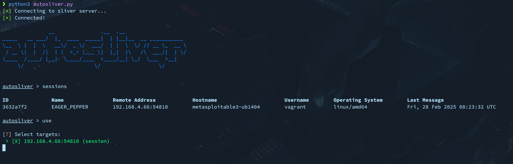

# autosliver
An alternative client for sliver for automating running commands on multiple sessions/beacons at once. Originally designed with use by red team during a blue team competition in mind. PRs are welcome.

## Usage
Put the path to your sliver connection configuration (.cfg) file into [autosliver.yaml](./autosliver.yaml).

Then:
```shell
pip install -r requirements.txt
python3 autosliver.py
```

## Example
